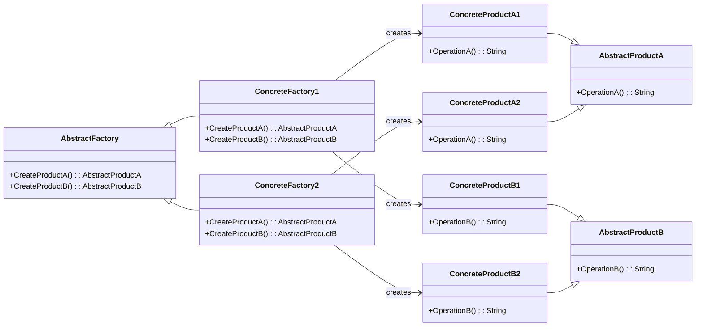

# Abstract Factory Pattern Overview

## Introduction

The Abstract Factory Pattern is a creational design pattern that provides an interface for creating families of related or dependent objects without specifying their concrete classes. It involves multiple Factory Methods, one for each type of object to be created. The main idea is to abstract the creation of objects depending on business logic, platform choice, and other criteria.

## Class Diagram

## Components

* **AbstractFactory**: The interface that specifies the methods for creating abstract products.
* **ConcreteFactory**: The class that implements the AbstractFactory to produce products that conform to the desired family of products.
* **AbstractProduct**: Represents the abstract products produced. (e.g., AbstractProductA and AbstractProductB).
* **ConcreteProduct**: The class that implements the AbstractProduct interface for a specific family.

## Usage Scenarios

* When the system needs to be independent of how its objects are created, composed, and represented.
* When the system is configured with multiple families of products.
* When a family of related product objects is designed to be used together, and you need to enforce this constraint.
Best Practices

## Best Practices

* Ensure that the products produced by the factory are compatible within a family.
* Abstract factories should remain independent from concrete product classes they create.
* Whenever possible, design abstract factories to be extensible without modifying their existing client code.

## Examples

* [[AbstractFactoryPatternExample]]:
Common implementation of the pattern.
