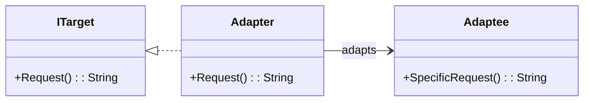

# Adapter

## Introduction

The Adapter Pattern is a structural design pattern that allows objects with incompatible interfaces to work together. It acts as a bridge between two incompatible interfaces. By wrapping the adaptee with a class that matches the target interface, the Adapter pattern allows the client to interact with the adaptee indirectly.

## Class Diagram

## Components

- **Target (ITarget)**: This is the interface that the client interacts with.
- **Adaptee**: The old or incompatible interface that needs adapting.
- **Adapter**: The class that joins the Adaptee to the Target. It translates the request from the client (using the target interface) to the adaptee.

## Usage Scenarios

- Adapter should focus only on adapting the interface, avoid adding additional functionalities.
- Ensure that the client always interacts with the target interface, not the adaptee directly.
- The Open/Closed principle can be preserved by using the Adapter pattern. It allows the main application to be decoupled from external libraries or systems, making it easier to update or change them in the future.

## Examples

[[AdapterPatternExample]]:
Common implementation of the pattern.