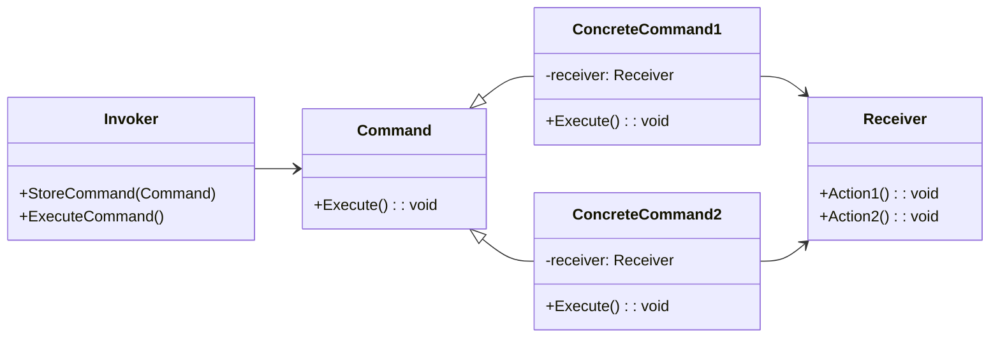

# Command Pattern Overview

## Introduction

The Command Pattern is a behavioral design pattern that turns a request into a stand-alone object that contains information about the request, such as the method name, its parameters, and the object to which the method belongs.
This decoupling allows parameterizing objects with operations, delaying operation execution, and saving operations for later reuse.

## Class Diagram

## Components

* **Invoker**: This class asks the command to execute a request.
* **Command (Command)**: The interface that specifies how to execute an operation.
* **ConcreteCommand**: The class that implements the Command interface and defines binding between a Receiver object and action.
* **Receiver**: Knows how to perform the operations associated with carrying out a request.

## Usage Scenarios

* When you need to parametrize objects with operations to be executed.
* When you need to queue requests, schedule their execution, or execute them remotely.
* When you want to support undoable operations.

## Best Practices

* Keep Commands simple.
If necessary, complex commands can be composed of simpler commands.
* Consider using Command for callback functions to avoid tight coupling between the components.
* Command classes should be focused on a single action.
This promotes single responsibility and makes them easier to reuse and maintain.

## Examples

* [[CommandPatternExample]]:
Common implementation of the pattern.
