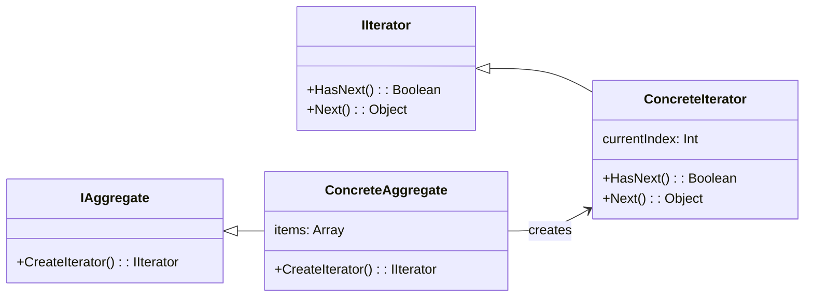

# Iterator Pattern Overview

## Introduction
The Iterator Pattern is a behavioral design pattern that provides a way to access the elements of an aggregate object sequentially without exposing its underlying representation.
It encapsulates the internal structure of how items are held and lets you traverse through these items without needing to understand or manage that structure.

## Class Diagram

## Components

* **Iterator (IIterator)**: The interface that defines methods for accessing and iterating over elements.
* **ConcreteIterator**: The class that implements the Iterator interface to traverse over the aggregate.
* **Aggregate (IAggregate)**: The interface that defines the method for creating an iterator for the collection.
* **ConcreteAggregate**: The class that implements the Aggregate interface and returns an instance of the ConcreteIterator.

## Usage Scenarios

* When you need to provide multiple ways to traverse a collection without exposing its underlying representation.
* When you want to separate the responsibility of traversal from the core logic of the collection.
* For providing a uniform interface for iterating over different aggregate structures (e.g., lists, trees).

## Best Practices

* Keep the iterator focused solely on traversal and avoid putting business logic inside it.
* Ensure the iterator properly manages the current position, especially when the underlying collection changes.
* Be cautious when working with concurrent modifications.
Many iterators might become invalid if the collection changes during iteration.

## Examples

* [[IteratorPatternExample]]:
Common implementation of the pattern.