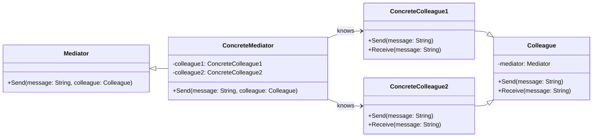

# Mediator Pattern Overview

## Introduction

The Mediator Pattern is a behavioral design pattern that promotes loose coupling by centralizing external communications.
It allows objects to interact with each other through a mediator, rather than directly, thus reducing their dependencies on one another.

## Class Diagram

## Components

* **Mediator (Mediator)**: The interface that defines the communication between colleague objects.
* **ConcreteMediator**: The class that centralizes communications between ConcreteColleague objects.
* **Colleague (Colleague)**: An abstract class or interface for objects that communicate with other colleagues through the mediator.
* **ConcreteColleague**: The class that implements the Colleague interface and communicates with other colleagues through the mediator.

## Usage Scenarios

* When you want to reduce the complexity and dependencies between a set of tightly coupled objects.
* When multiple classes interact and produce interdependencies, which are difficult to change.
* When you want to promote many-to-many relationships to be centralized to one-to-many.

## Best Practices

* Ensure that the mediator is solely responsible for directing the communication between colleague objects and does not perform work that should belong to the colleagues.
* Mediators should remain neutral and not hold state that pertains to business logic.
* Consider the impact on performance, as centralizing the communication can introduce a bottleneck.

## Examples

* [[MediatorPatternExample]]:
Common implementation of the pattern.
