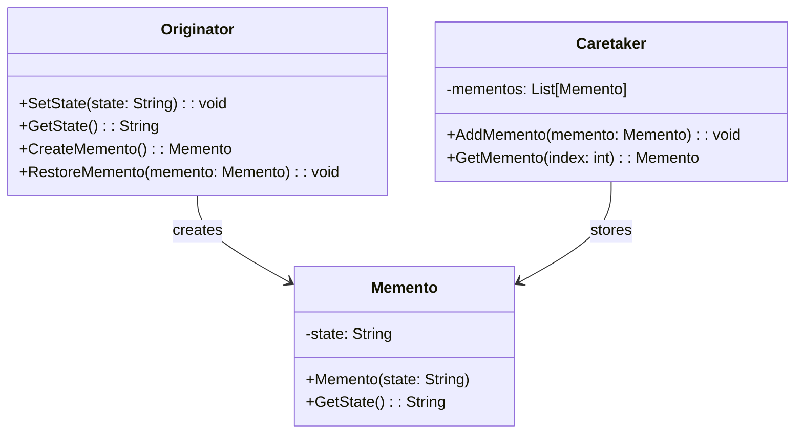

# Memento Pattern Overview

## Introduction

The Memento Pattern is a behavioral design pattern that allows for the ability to restore an object to its previous state, which can be useful for features like undo mechanisms.
It primarily involves three roles: Originator, Caretaker, and Memento.

## Class Diagram

## Components

* **Originator**: The object that knows how to save its internal state and restore it from a memento.
* **Memento**: A value object that stores the internal state of the Originator.
It should not be modified once it's created.
* **Caretaker**: Responsible for keeping track of the mementos but never modifies or even looks at the internal state of the mementos.

## Usage Scenarios

* When you need to implement an undo mechanism or restore functionality to previous states.
* When the internal state of an object must be saved externally without exposing its implementation.
* When encapsulation boundaries have to be preserved.

## Best Practices

* Ensure that only the Originator has access to the Memento’s internal state.
* Mementos should be stored and retrieved by the Caretaker, but the Caretaker should never operate on or examine the contents of a Memento.
* Memento can be made more generic to support various states if needed.

## Examples

* [[MementoPatternExample]]:
Common implementation of the pattern.
yaml

