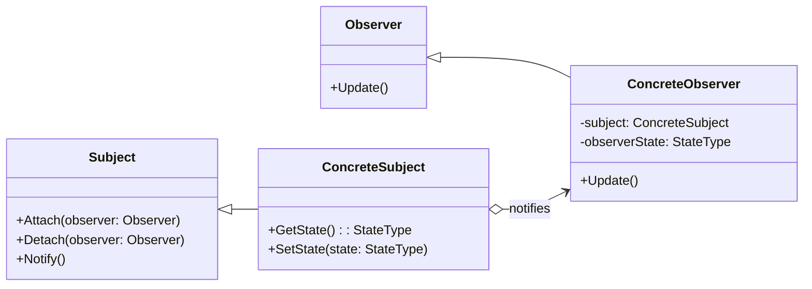

# Observer Pattern Overview

## Introduction

The Observer Pattern is a behavioral design pattern that defines a one-to-many dependency between objects.
When one object (subject) changes its state, all its dependents (observers) are notified and updated automatically.
It is primarily used to implement distributed event handling systems.

## Class Diagram

## Components

* **Subject**: It knows its observers and provides an interface for attaching, detaching, or notifying observers.
* **Observer**: Defines an updating interface for objects that should be notified of changes in a subject.
* **ConcreteSubject**: Stores the state of interest to ConcreteObserver objects. Sends a notification to its observers when its state changes.
* **ConcreteObserver**: Maintains a reference to a ConcreteSubject object. Implements the Observer updating interface to keep its state consistent with the subject's.

## Usage Scenarios

* When an abstraction has two aspects, one dependent on the other.
Encapsulating these aspects in separate objects allows them to vary and evolve independently.
* When a change to one object requires changing others, but you don’t know how many objects need to be changed.
* When an object should be able to notify other objects without making assumptions about who these objects are.

## Best Practices

* Consider using a mediator object if multiple subjects need to be observed, to reduce direct connections between subjects and observers.
* Be cautious about the order of notification, as one observer's update method might affect another.
* When adding and removing observers, ensure thread safety if applicable.

## Examples

* [[ObserverPatternExample]]:
Common implementation of the pattern.
