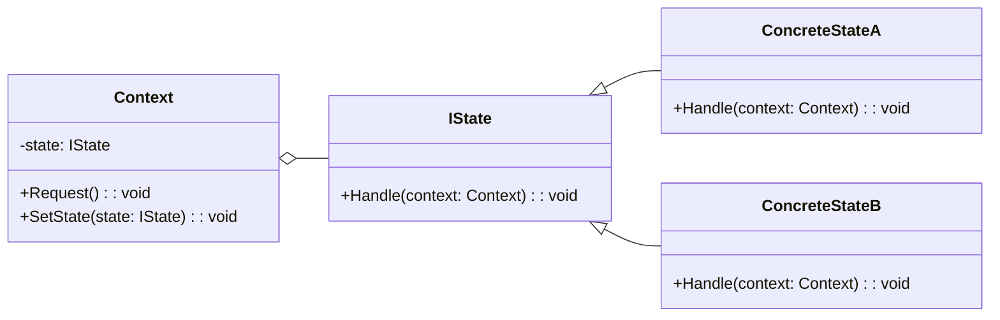

# State Pattern Overview

## Introduction

The State Pattern is a behavioral design pattern that allows an object to alter its behavior when its internal state changes.
This pattern treats state-specific behavior as independent classes, allowing a context to change its behavior by simply changing its current state object.

## Class Diagram

## Components

* **Context**: Maintains an instance of a concrete state subclass that defines the current state.
The context delegates the state-specific requests to the current state object.
* **State (IState)**: Defines an interface for encapsulating the behavior associated with a particular state of the context.
* **ConcreteState**: Each subclass of State implements a behavior associated with a state of the Context.

## Usage Scenarios

* When an object's behavior depends on its state and must change its behavior at runtime depending on that state.
* When operations have large, multi-part conditional statements that depend on the object's state.

## Best Practices

* Keep each state's specific behavior well-encapsulated in separate classes.
* The Context should delegate state-specific behavior to the current State object, rather than implementing state-specific behavior directly.
* Avoid having states store a reference to the Context if possible.
Instead, pass the Context as a parameter in state transitions.

## Examples

* [[StatePatternExample]]:
Common implementation of the pattern.
