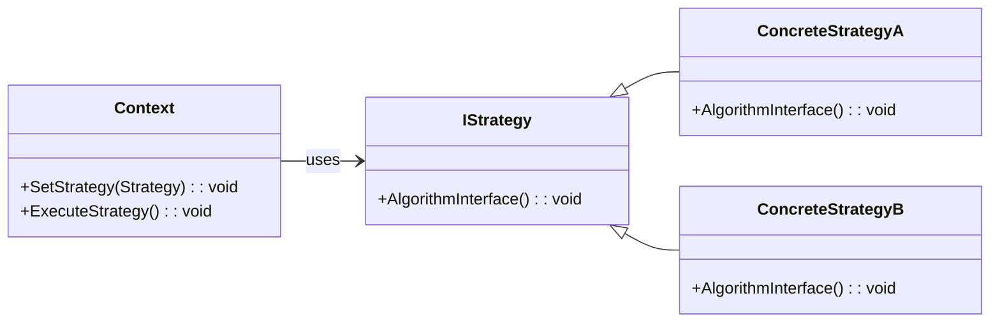

# Strategy Pattern Overview

## Introduction

The Strategy Pattern is a behavioral design pattern that defines a set of algorithms, encapsulates each algorithm, and makes them interchangeable.
This allows the strategy to be selected independently from the clients that use it.
Essentially, the strategy pattern allows algorithms to be defined and selected at runtime.

## Class Diagram

## Components

* **Context**: The class that maintains a reference to a Strategy object and can switch between strategies.
* **Strategy (IStrategy)**: The interface common to all concrete strategies, declaring an action.
* **ConcreteStrategy**: The class that implements the Strategy interface by providing specific implementations of the action.

## Usage Scenarios

* When different variants of an algorithm exist, and they can be selected on-the-fly.
* When an algorithm uses data that clients shouldn't be exposed to.
Strategy can be used to avoid exposing complex, algorithm-specific data structures.
* When a class defines multiple behaviors and these appear as multiple conditional statements.
Instead of many conditionals, move related conditional branches into their own strategy class.

## Best Practices

* Define each strategy as a separate class with a common interface.
This allows for easy swapping of strategies.
* Strategies should be stateless if possible.
* The Context should avoid defining any strategy-specific operations.

## Examples

* [[StrategyPatternExample]]:
A typical implementation of the pattern.
