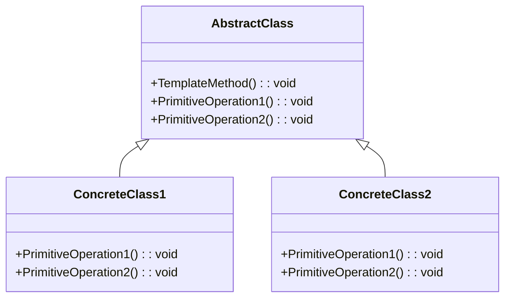

# Template Method Pattern Overview

## Introduction

The Template Method Pattern is a behavioral design pattern that defines the structure of an algorithm in a method of a base class, but delays the implementation of the specific steps to the subclasses.
This allows subclasses to redefine certain steps of an algorithm without changing its overall structure.

## Class Diagram

## Components

* **AbstractClass**: The base class that defines the template method and declares the primitive operations.
The template method calls these operations to complete its algorithm.
* **ConcreteClass**: The subclasses that implement the primitive operations, providing specific behavior for each step of the algorithm.

## Usage Scenarios

* When the invariant (non-varying) steps of an algorithm should be captured once in a method that can be handed down to subclasses.
* When common behavior among subclasses should be centralized to avoid code duplication.
* When subclasses must be allowed to refine individual steps of an algorithm without altering its overall structure.

## Best Practices

* Ensure that the template method is declared as final to prevent subclasses from overriding its sequence.
* Use hooks in the abstract class to provide default behavior that subclasses can extend if necessary.
* The Template Method Pattern is meant to offer a framework for an algorithm.
Avoid making it overly complex.

## Examples

* [[TemplateMethodPatternExample]]:
Common implementation of the pattern.
