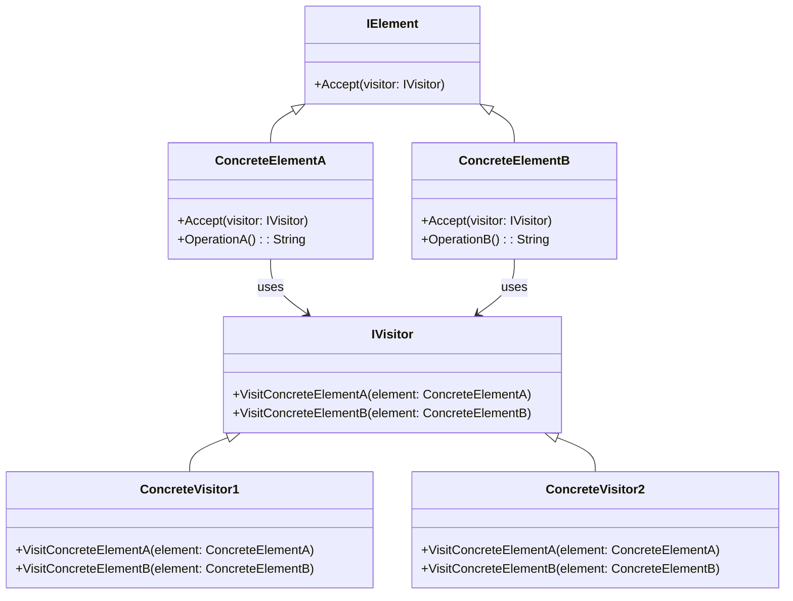

# Visitor Pattern Overview

## Introduction

The Visitor Pattern is a behavioral design pattern that allows adding further operations to objects without having to modify them.
It achieves this by using a separate visitor class that provides the required functionality.
This pattern is particularly useful when many distinct and unrelated operations need to be performed on elements of an object structure.

## Class Diagram

## Components

* **Element (IElement)**: The interface that defines an accept operation that takes a visitor as an argument.
* **ConcreteElement**: The class that implements the Element interface and has a visit method for the visitor.
* **Visitor (IVisitor)**: The interface for all visitors, declaring visit methods for all types of concrete elements.
* **ConcreteVisitor**: The class that implements the Visitor interface and defines the visit operations for all types of concrete elements.

## Usage Scenarios

* When you need to perform operations across a set of objects with different interfaces, and you want to avoid "polluting" their classes with these operations.
* When the classes in a structure rarely change, but you often need to define new operations over them.
* When operations should work across multiple classes that are not necessarily related through inheritance.

## Best Practices

* Use the Visitor Pattern when you need to perform an operation on all elements of a complex object structure (like an abstract syntax tree).
* Ensure that the element interface is stable and won't change frequently.
If it does, the pattern becomes hard to maintain since any change forces a modification of all visitor classes.
* Separate the logic from data structures.
Visitors can provide functionality that isn't necessarily a part of each element's primary job.

## Examples

* [[VisitorPatternExample]]:
Common implementation of the pattern.
