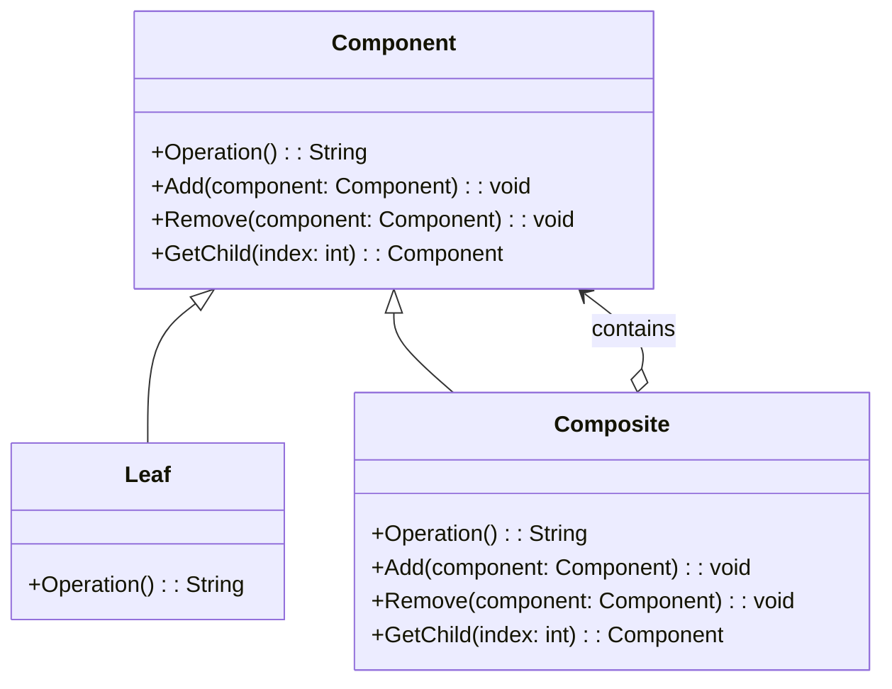

# Composite Pattern Overview

## Introduction

The Composite Pattern is a structural design pattern that allows you to compose objects into tree structures to represent part-whole hierarchies.
Composite lets clients treat individual objects and compositions of objects uniformly.
It is particularly useful when you want clients to be able to ignore the difference between compositions of objects and individual objects.

## Class Diagram

## Components

* **Component**: Defines the interface for objects in the composition. It can be an interface or an abstract class with some methods defined.
* **Leaf**: Represents the leaf object in the composition. It has no children and implements the component interface.
* **Composite**: It has child components, and it implements the component interface.

## Usage Scenarios

* When you need to represent part-whole hierarchies of objects.
* When you want clients to be able to treat individual objects and compositions of objects uniformly.
* When the client code should be independent of the object composition hierarchy.

## Best Practices

* Clearly define the component interface.
* Use the Composite Pattern only when the group of objects should behave as one object.
* Be careful with shared components. When a shared component is removed from a composite, it might create problems if the client still holds a reference to it.

## Examples

* [[CompositePatternExample]]: Common implementation of the pattern.