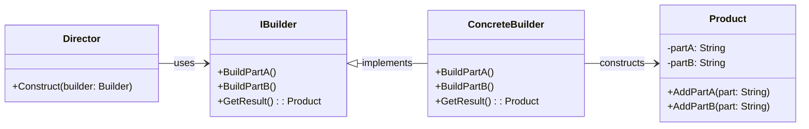

# Builder Pattern Overview

## Introduction

The Builder pattern is a creational design pattern that provides a way to construct a complex object step by step.
It is especially useful when an object has numerous optional or required configurations.
The pattern separates the construction of a complex object from its representation, allowing the same construction process to create different representations.

## Class Diagram

## Components

- **Builder**: The interface that specifies the methods needed for building a part of the complex object.
- **ConcreteBuilder**: The class that implements the Builder interface to construct the product.
- **Director**: Responsible for constructing the product using one or more builder objects. (Optional, based on the use case)
- **Product**: The complex object that is being built.

## Usage Scenarios

- When an object needs to be constructed with numerous possible configurations.
- When the object's constructor would have more than a few parameters.

## Best Practices

- Make the final product (e.g., `Car` object) immutable after it's built.
- Chain builder methods for a fluent API.
- Consider parameterizing builder methods for greater flexibility.

## Examples

* [[BuilderPatternExample]]:
Common implementation of the pattern.

* [[AdjustedBuilderPatternExample]]: Adjusted implementation that incorparates best practices. 
