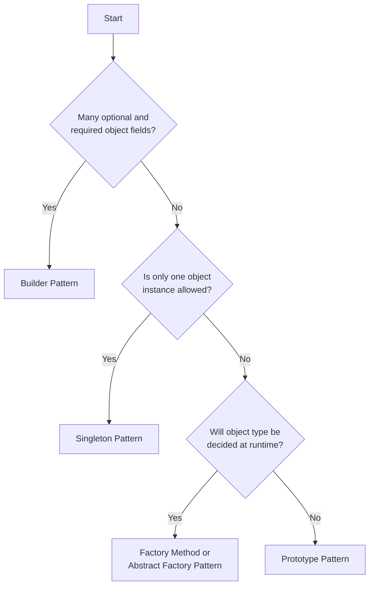

# Creational Patterns

[[Singleton]]: Ensures a class has only one instance and provides a global point to access it.

[[Factory Method]]: Defines an interface for creating an object, but allows subclasses to alter the type of objects that will be created.

[[Abstract Factory]]: Provides an interface for creating families of related or dependent objects without specifying their concrete classes.

[[Builder]]: Separates the construction of a complex object from its representation.

[[Prototype]]: Creates new objects by copying an existing object

## Decision Tree

