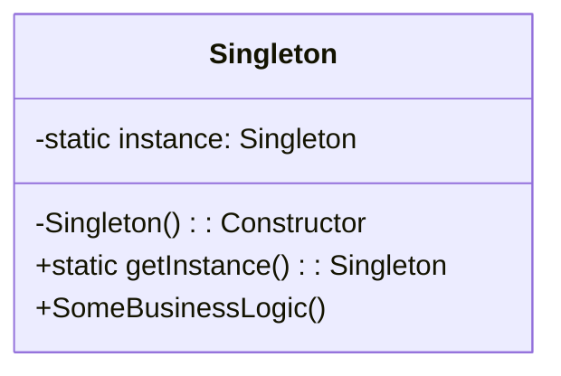

# Singleton Pattern Overview

## Introduction

The Singleton Pattern is a creational design pattern that ensures a class has only one instance and provides a global point of access to that instance. The idea is to make the constructor private and expose the instance via a static method. This ensures that there is only one instance of the class in the system and provides a controlled way to access it.

## Class Diagram

## Components

* **Singleton**: The class that has only one instance and provides a global point of access to that instance. It controls its own instantiation by making the constructor private and exposes the unique instance through a static method.

## Usage Scenarios

* When you want to ensure that a class has just one instance and it is accessible from any point in the code.
* When you want to control access to shared resources, like a configuration object or connection pool.
* When you need to maintain state in a global manner or coordinate actions across the system.

## Best Practices

* Ensure the Singleton class is thread-safe, especially the method returning the instance, to avoid potential race conditions.
* Avoid using Singletons as a global state or global variables. Use them where the single instance is genuinely needed.
* Lazy initialization can be used to improve performance by delaying the creation of the Singleton instance until it's needed.

## Examples

* [[SingletonPatternExample]]:
Common implementation of the pattern.
