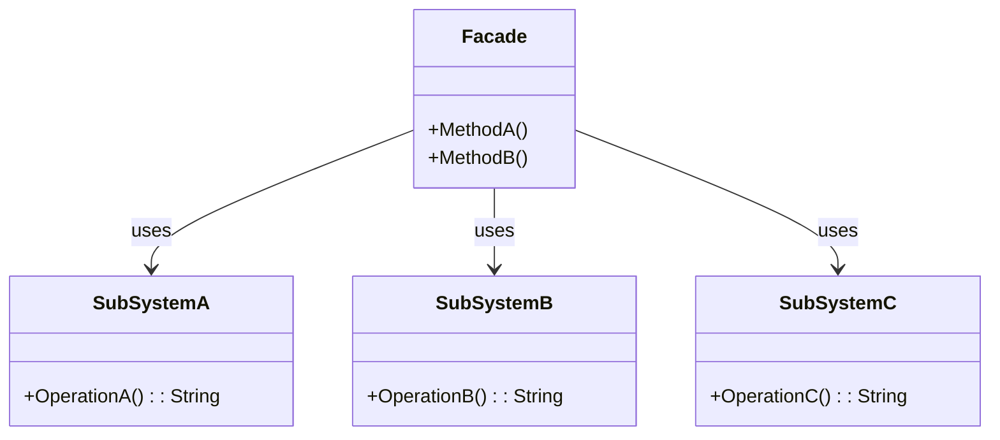

# Facade Pattern Overview

## Introduction

The Facade Pattern is a structural design pattern that provides a simplified interface to a larger body of code, such as a class library. A facade hides the complexities of the system and provides a simplified interface to the client. It typically involves a single wrapper class which contains a set of members required by the client.

## Class Diagram

## Components

* **Facade (Facade)**: Provides a simplified interface to the subsystem. It delegates client requests to appropriate subsystem objects.
* Subsystems: These are components of a more complex system that the facade wraps around. They implement intricate functionalities but lack a unified and simple interface.

## Usage Scenarios

* When you want to provide a simple interface to a complex system.
* When there are many dependencies between clients and the implementation classes of an abstraction.
* When you want to layer your subsystems.

## Best Practices

* Ensure that the facade does not become a "god class" by delegating the tasks to appropriate subsystem classes.
* Consider using the facade to define entry points for each level of complexity in your subsystem.
* The facade should be a convenience class, not a mandatory one. Clients should still be able to interact with subsystems directly if they need to.

## Examples

* [[FacadePatternExample]]:
Common implementation of the pattern.
