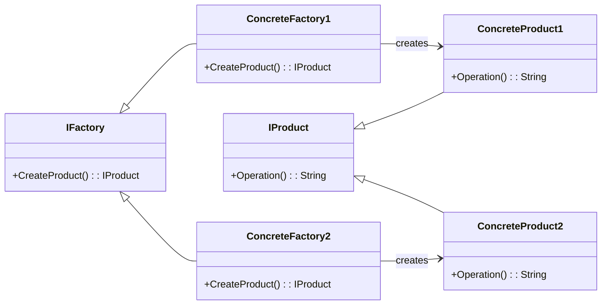

# Factory Pattern Overview

## Introduction

The Factory Pattern is a creational design pattern that provides an interface for creating objects, but allows subclasses to decide which class to instantiate. The Factory Method design pattern handles object creation by defining a method that’s meant for creating objects, allowing subclasses to decide the type of objects to create.

## Class Diagram

## Components

- **Factory (IFactory)**: The interface that specifies the method for creating a product.
- **ConcreteFactory**: The class that implements the Factory interface to construct the product.
- **Product (IProduct)**: The interface for the type of objects the factory method creates.
- **ConcreteProduct**: The class that implements the Product interface.

## Usage Scenarios

- When a class can’t anticipate the class of objects it must create.
- When a class wants its subclasses to specify the objects it creates.
- When classes delegate responsibilities to one or several helper subclasses and you want to localize the knowledge of which helper subclass is the delegate.

## Best Practices

- Keep the Factory responsible for only object creation, avoid putting any business logic in the factory.
- Consider using Lazy Initialization inside factories for better performance and resource management.
- When applicable, make factories return instances of an interface, rather than concrete implementations.

## Examples

* [[FactoryPatternExample]]:
Common implementation of the pattern.
