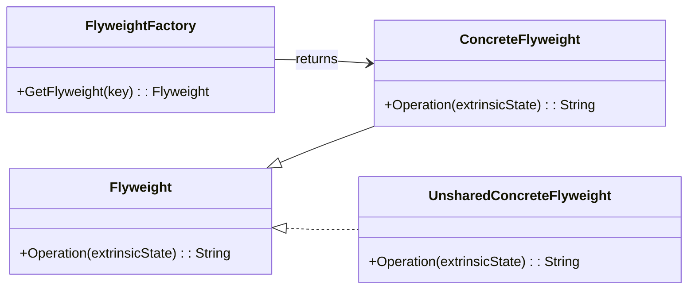

# Flyweight Pattern Overview

## Introduction

The Flyweight Pattern is a structural design pattern that aims to minimize memory usage by sharing as much data as possible with similar objects. Instead of creating a large number of similar objects, this pattern uses objects already created, whenever possible.

## Class Diagram

## Components

* **FlyweightFactory**: Responsible for creating and managing flyweight objects. It ensures that flyweights are shared properly. When a client requests a flyweight, the factory either returns an existing instance or creates a new one, if none exists.
* **Flyweight**: The interface through which flyweights can receive and act on extrinsic states.
* **ConcreteFlyweight**: Implements the Flyweight interface and stores intrinsic state. This intrinsic state must be shareable. Concrete flyweights must be sharable and capable of handling requests which depend on the extrinsic state.
* **UnsharedConcreteFlyweight**: Not all Flyweight subclasses need to be shared. The Flyweight interface enables sharing, but it doesn’t enforce it.

## Usage Scenarios

* When a program must support a large number of nearly identical objects, making it impractical to store each one individually due to memory constraints.
* When object identity is not a concern, and objects can be easily replaced by shared objects.
* When most object states can be made extrinsic, separated and passed in when necessary.
Best Practices

## Best Practices

* Ensure that the distinction between intrinsic and extrinsic states is clear. Only intrinsic states should reside within the flyweight objects.
* Use the flyweight pattern when there are opportunities to share data across a large number of similar objects.
* Be aware of threading concerns. The Flyweight pattern is often used in multi-threaded contexts, so ensure shared objects are immutable or access to them is synchronized.

## Examples

* [[FlyweightPatternExample]]:
Common implementation of the pattern.
