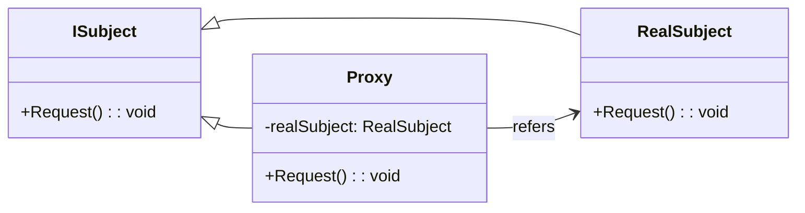

# Proxy Pattern Overview

## Introduction

The Proxy Pattern provides a surrogate or placeholder for another object to control access to it. It is a structural design pattern that involves a class that functions as an interface to something else. This pattern is used when you need a versatile or sophisticated reference to an object than just a pointer.

## Class Diagram

## Components

* Subject (ISubject): The interface that defines the common methods for the RealSubject and Proxy so that the Proxy can be used anywhere the RealSubject is expected.
* RealSubject: The class that the Proxy represents and provides the real functionality that the client is interested in.
* Proxy: The class that maintains a reference to the RealSubject, and can control access to it, possibly delaying the instantiation and loading of it.

## Usage Scenarios

* When you want to provide controlled access to an object.
* When you need a more versatile or sophisticated reference to an object than a simple pointer.
* When you want to load an object on demand (lazy instantiation).
* When you want to add additional functionalities (like logging, caching, etc.) without modifying the RealSubject code.
Best Practices

## Best Practices

* Ensure that the RealSubject is only accessed through the Proxy to maintain controlled access.
* Proxy should delegate most of its work to the RealSubject once it decides to forward the request.
* Consider using smart pointers in situations where memory management is a concern.

## Examples

* [[ProxyPatternExample]]:
Common implementation of the pattern.
