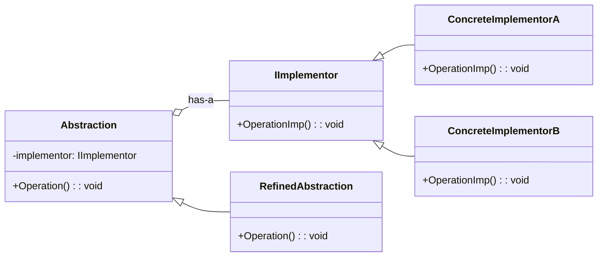

# Bridge Pattern Overview

## Introduction

The Bridge Pattern is a structural design pattern that decouples an abstraction from its implementation, allowing the two to vary independently. Instead of a fixed binding between an interface and its implementation, the Bridge pattern prefers composition over inheritance, allowing more flexibility in configurations and extensions.

## Class Diagram

## Components

- **Abstraction**: The abstraction defines the interface and maintains a reference to an object of type Implementor.
- **RefinedAbstraction**: Extends the Abstraction to define variant interfaces.
- **Implementor**: This is the base interface for concrete implementations. Both the Abstraction and Implementor hierarchies can be extended separately.
- **ConcreteImplementor**: The concrete classes that implement the Implementor interface.

## Usage Scenarios

- When you want to decouple an abstraction from its implementation so that the two can change independently.
- When changes in the implementation of an abstraction won't affect clients, which means the Bridge pattern allows hiding details from clients.
- When you have a proliferation of classes resulting from a coupled interface and numerous implementations.

## Best Practices

- Avoid an overly detailed Abstraction interface. The interface should be focused on high-level functionalities.
- Implementor should be unaware of the Abstraction.
- The separation allows for multiple Abstractions and multiple Implementors, providing flexibility and scalability.

## Examples

* [[BridgePatternExample]]: Common implementation of the pattern.
