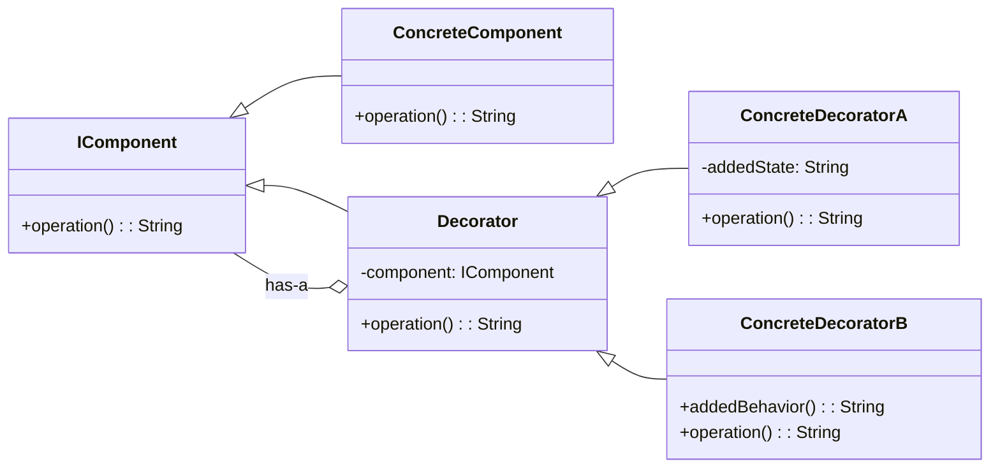

# Decorator Pattern Overview

## Introduction

The Decorator Pattern is a structural design pattern that enables you to add new behaviors to objects by placing these objects inside special wrapper classes that contain the new behaviors. Instead of modifying objects themselves, we can wrap them in decorator classes to extend their behaviors, conforming to the open/closed principle.

## Class Diagram

## Components

* **Component**: Defines an interface for objects that can have responsibilities added to them dynamically.
* **ConcreteComponent**: Defines an object to which additional responsibilities can be added.
* **Decorator**: Maintains a reference to a Component object and defines an interface that conforms to Component's interface.
* **ConcreteDecorator**: Adds responsibilities to the component.

## Usage Scenarios

* When you need to add responsibilities to individual objects dynamically and transparently, that is, without affecting other objects.
* When extension by subclassing is impractical. Sometimes a large number of independent extensions are possible and would produce an explosion of subclasses to support every combination.

## Best Practices

* Ensure Decorator classes have a component of the same type as the decorated objects.
* Decorators should pass all requests to the component, including the ones they don’t modify.
* Use decorator chains judiciously to avoid unnecessary complexity and overheading in the object interaction.
Examples

## Examples

* [[DecoratorPatternExample]]:
Common implementation of the pattern.
